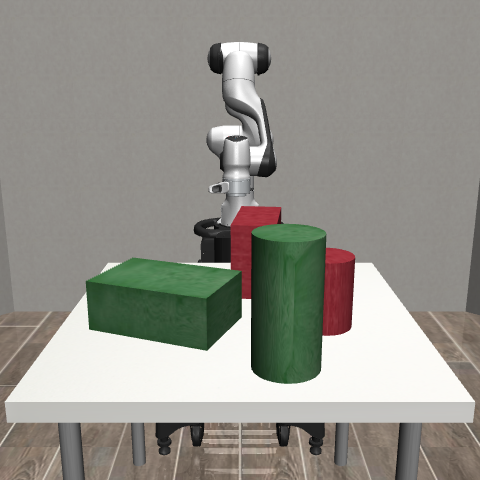
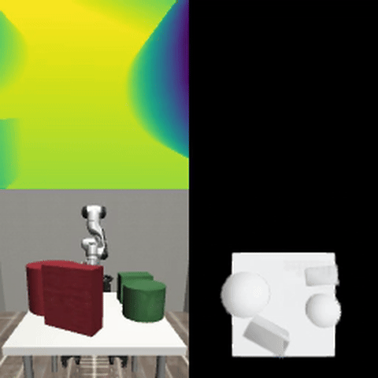

# tum-adlr-18
**Frank Zillmann's Advanced Deep Learning for Robotics Project: Efficient Environment Exploration and 3D Reconstruction with Reinforcement Learning and Multiple View Geometry**

<!--  -->


Rollout of untrained policy, showing TCP camera depth, frontview camera RGB, birdview reconstruction rendering, and birdview ground truth rendering:


## Installation

1. Clone the repository:
```bash
git clone https://github.com/frank-zillmann/tum-adlr-18 --recursive
cd tum-adlr-18
```

2. Run the setup script:
```bash
source ./install/setup.sh
```

## Usage
### Training
To train a model, use the provided training script with a configuration file. The current available configurations are:
```bash
# Train using nvblox and voxel-wise TSDF error
python scripts/train.py --config configs/nvblox_voxelwise_tsdf_error.yaml

# Train using nvblox and Chamfer distance
python scripts/train.py --config configs/nvblox_chamfer_distance.yaml

# Train using Open3D and Chamfer distance
python scripts/train.py --config configs/open3d_chamfer_distance.yaml
```

One can also pass multiple configuration files to use debug or demo mode (in case of conflicting parameters, the last config file would take precedence) and provide a checkpoint to resume training:
```bash
# Minimal run for debugging
python scripts/train.py --config configs/nvblox_voxelwise_tsdf_error.yaml configs/debug.yaml

# Minimal run with increased resolution for demo purposes
python scripts/train.py --config configs/open3d_chamfer_distance.yaml configs/demo.yaml

# Resume training from a checkpoint
python scripts/train.py --config configs/nvblox_voxelwise_tsdf_error.yaml --checkpoint path/to/checkpoint.zip
```

### Create episode videos
To create videos of the evaluation episodes, use the `create_episode_video.py` script:
```bash
python scripts/create_episode_videos.py path/to/run/eval_data/episode_xxxx
```
You can modify the script to change the camera views and frame rate.

### Scripted Table Edge Policy
A hard-coded baseline policy is available that moves the robot TCP along the edges of the table (at the corners ±0.3m from center, z≈1.1m), while keeping the camera pointed at the table center (z≈0.9m). This is useful for comparing against learned policies.

```bash
# Run scripted policy with Open3D reconstruction
python scripts/eval_scripted.py --config configs/open3d_chamfer_distance.yaml --n_episodes 3

# Run scripted policy in debug mode
python scripts/eval_scripted.py --config configs/open3d_chamfer_distance.yaml configs/debug.yaml --n_episodes 1
```

## Known issues and fixes:
I used a CPU-only laptop and a Google Cloud VM with NVIDIA T4 GPU and `pytorch-2-7-cu128-ubuntu‑2404‑nvidia‑570` image.

**1. OpenCV/libGL error** (`libGL.so.1: cannot open shared object file`):
```bash
sudo apt install -y libgl1
```

**2. EGL error** (NVIDIA GPU offscreen rendering backend):
```bash
# Mesa EGL libraries (base requirement)
sudo apt install -y libegl1-mesa-dev libgles2-mesa-dev

# NVIDIA EGL (required for headless GPU rendering with NVIDIA drivers)
# Replace 570 with your driver version (check with: nvidia-smi)
sudo apt install -y libnvidia-gl-570-server
```

**3. MuJoCo rendering backend** (set EGL for headless/offscreen rendering):
```bash
export MUJOCO_GL=egl
# Add to ~/.bashrc for persistence:
echo 'export MUJOCO_GL=egl' >> ~/.bashrc
```

**4. EGL device enumeration fails with Mesa** (`Cannot initialize a EGL device display`):
If you have both NVIDIA and Mesa EGL drivers installed, the device enumeration may fail on Mesa devices. Force NVIDIA-only EGL:
```bash
export __EGL_VENDOR_LIBRARY_FILENAMES=/usr/share/glvnd/egl_vendor.d/10_nvidia.json
# Add to ~/.bashrc for persistence:
echo 'export __EGL_VENDOR_LIBRARY_FILENAMES=/usr/share/glvnd/egl_vendor.d/10_nvidia.json' >> ~/.bashrc
```

**5. GPU render device permission denied** (`failed to open /dev/dri/renderD128: Permission denied`):
```bash
sudo usermod -aG render $USER
sudo usermod -aG video $USER
# Log out and back in, or use newgrp to apply immediately:
newgrp render
newgrp video
```

**6. Render images from robosuite are upside down** (e.g. when using EGL backend):
```bash
python external/robosuite/robosuite/scripts/setup_macros.py
```
In the created file external/robosuite/robosuite/macros_private.py switch from opengl to opencv convention:
```python
IMAGE_CONVENTION = "opencv"  # Options are {"opengl", "opencv"}
```

**7. CUDA out of memory error**:

Memory consumption:

```bash
pid=$(pgrep -f "train.py")

# after about 1 minute
ps -o pid,comm,rss,vsz -p "$pid"
    PID COMMAND           RSS    VSZ
2211719 pt_main_thread  2698420 47006788

nvidia-smi --query-compute-apps=pid,process_name,used_memory --format=csv,noheader | grep "$pid"
2211719, python, 2104 MiB

# after about 30 minutes
ps -o pid,comm,rss,vsz -p "$pid"
    PID COMMAND           RSS    VSZ
2211719 pt_main_thread  3295588 48036664

nvidia-smi --query-compute-apps=pid,process_name,used_memory --format=csv,noheader | grep "$pid"
2211719, python, 2676 MiB

# after some hours
ps -o pid,comm,rss,vsz -p "$pid"
PID COMMAND RSS VSZ
575936 pt_main_thread 3729660 57844976

nvidia-smi --query-compute-apps=pid,process_name,used_memory --format=csv,noheader | grep "$pid"
575936, python, 11538 MiB
```

Error after about 12 hours of training:
```bash
CUDA error = 2 at /nvblox/nvblox/include/nvblox/core/internal/impl/unified_vector_impl.h:231 'cudaMallocAsync(&new_buffer, sizeof(T) * capacity, cuda_stream)'. Error string: out of memory.

# OR

WARNING: Nan, Inf or huge value in QACC at DOF 22. The simulation is unstable. Time = 1.2860.

WARNING: Nan, Inf or huge value in QACC at DOF 22. The simulation is unstable. Time = 4.4220.

WARNING: Nan, Inf or huge value in QACC at DOF 22. The simulation is unstable. Time = 1.3420.

WARNING: Nan, Inf or huge value in QACC at DOF 22. The simulation is unstable. Time = 1.7200.

WARNING: Nan, Inf or huge value in QACC at DOF 22. The simulation is unstable. Time = 1.4180.

WARNING: Nan, Inf or huge value in QACC at DOF 23. The simulation is unstable. Time = 3.3380.

WARNING: Nan, Inf or huge value in QACC at DOF 22. The simulation is unstable. Time = 7.2740.

CUDA error = 2 at /nvblox/nvblox/include/nvblox/core/internal/impl/unified_vector_impl.h:231 'cudaMallocAsync(&new_buffer, sizeof(T) * capacity, cuda_stream)'. Error string: out of memory.
```

**8. RESOLVED: Segmentation fault after several thousand steps** 

`pgrep -f "train.py"
[1]+  Segmentation fault      (core dumped) nohup python scripts/train.py --config configs/nvblox_voxelwise_tsdf_error.yaml > nvblox_voxelwise_tsdf_error.log 2>&1`

Caused by now deprecated/replaced render_mesh_open3d function which had a memory leak.

## Next steps:

- exclude voxels of the underside of the table / the table at all
